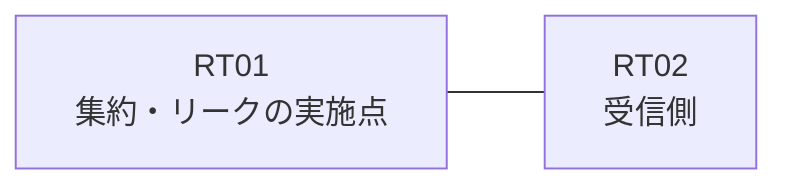

# 問題 20261001-015

> **本問は機器に接続せずに解答すること。追加の show 実行は認めない。**

## 設問

拠点のルータ RT01 は、複数のループバック・インターフェイスによって、サービスのためのアドレスのブロック 10.4.6.4/30 を収容しています。RT01 と RT02 は、1本のリンクによって直接に接続されており、そして、EIGRP 6571 が構成されています。集約のルートおよび明細のルートは、いずれも、EIGRP の内部のルートとして受信される、かつ、運用のためのループバック 10.233.44.15 (/32) は、引き続き受信される、かつ、RT02 に対して、ブロック 10.4.6.4/30 は、集約のルートとして広告される、かつ、監視のためのホストである 10.4.6.6 (/32) の明細のルートは、集約とともに、受信されるという条件において、正しいものを、下記から選択しなさい。ブロックの内部の明細のルートは、広告されず、ルーティング プロトコルの種別およびプロセスの配置は、変更されないことが求められます。



| 対象 | 内容 |
|------|------|
| RT01 のループバック | 10.4.6.5, 10.4.6.6, 10.4.6.7 |
| RT01 の運用系ループバック | 10.233.44.15 |
| RT01 ⇔ RT02 のリンク | 10.185.247.0/24（RT01=10.185.247.1 / RT02=10.185.247.2・Ethernet0/0） |

```
RT02# show ip route eigrp | begin Gateway
Gateway of last resort is not set
      10.0.0.0/8 is variably subnetted, 3 subnets, 2 masks
D        10.4.6.4/30 [90/409600] via 10.185.247.1, 00:14:56, Ethernet0/0
D EX     10.4.6.7/32 [170/409600] via 10.185.247.1, 00:14:56, Ethernet0/0
D        10.233.44.15/32 [90/409600] via 10.185.247.1, 00:14:56, Ethernet0/0
```
```
RT01# show running-config
Building configuration...
!
interface Loopback0
 ip address 10.4.6.5 255.255.255.255
interface Loopback1
 ip address 10.4.6.6 255.255.255.255
interface Loopback2
 ip address 10.4.6.7 255.255.255.255
interface Loopback10
 ip address 10.233.44.15 255.255.255.255
interface Ethernet0/0
 description === to RT02 ===
 ip address 10.185.247.1 255.255.255.252
 ip summary-address eigrp 6571 10.4.6.4 255.255.255.252 leak-map RM-LEAK
!
router eigrp 6571
 network 10.233.44.15 0.0.0.0
 network 10.185.247.0 0.0.0.3
 redistribute connected route-map RM-LEAK
!
access-list 15 permit 10.4.6.7
access-list 20 permit 10.4.6.7
!
route-map LEAK permit 10
 match ip address prefix-list MON32
route-map RM-LEAK permit 10
 match ip address 20
!
```

## 選択肢

A. ルート・マップの permit のエントリに、match のステートメントが存在しない

B. ルート・マップが参照しているところの名前のリストが、定義されていない

C. EIGRP のスタブ・ルーティングの構成によって、広告が制限されている

D. 再配布が参照しているところのリストにおいて、対象のループバックのアドレスが許可されていない

E. leak-map が参照しているところの名前のルート・マップが、定義されていない

F. distribute-list によって、当該のインターフェイスからの広告がフィルタされている
