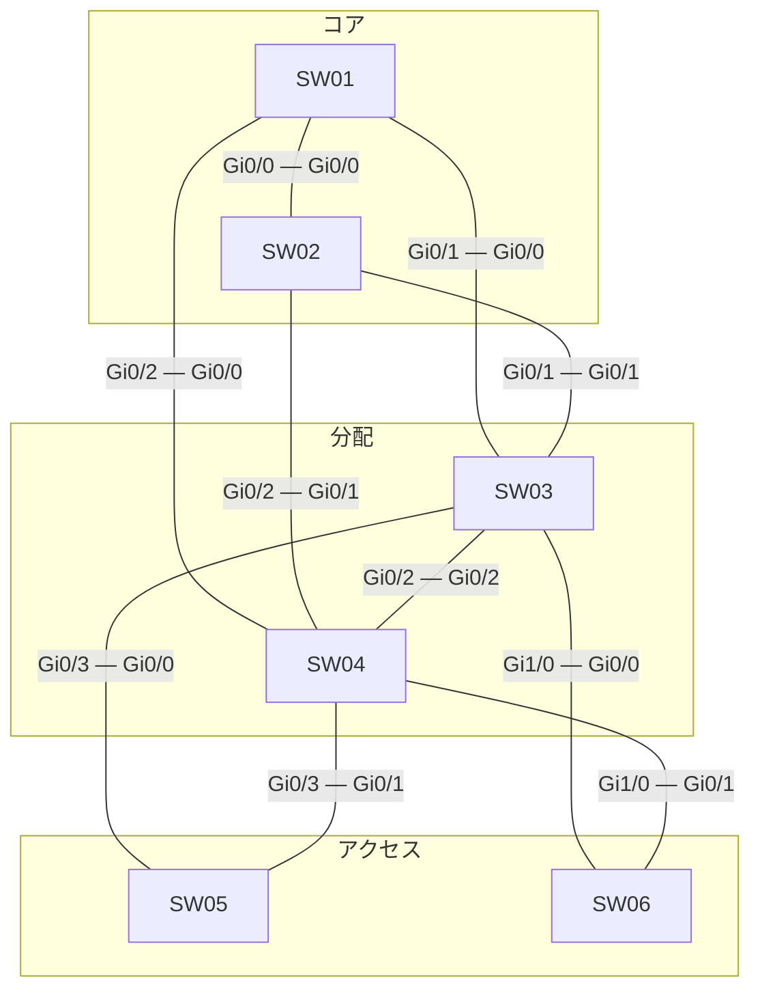

# 問題 20261001-016

> **本問は機器に接続せずに解答すること。追加の show 実行は認めない。**

## シナリオ



| スイッチ | インタフェース(ポート番号) | 対向スイッチ | 対向インタフェース(ポート番号) |
|---|---|---|---|
| SW01 | Gi0/0(1) | SW02 | Gi0/0(1) |
| SW01 | Gi0/1(2) | SW03 | Gi0/0(1) |
| SW01 | Gi0/2(3) | SW04 | Gi0/0(1) |
| SW02 | Gi0/1(2) | SW03 | Gi0/1(2) |
| SW02 | Gi0/2(3) | SW04 | Gi0/1(2) |
| SW03 | Gi0/2(3) | SW04 | Gi0/2(3) |
| SW03 | Gi0/3(4) | SW05 | Gi0/0(1) |
| SW03 | Gi1/0(5) | SW06 | Gi0/0(1) |
| SW04 | Gi0/3(4) | SW05 | Gi0/1(2) |
| SW04 | Gi1/0(5) | SW06 | Gi0/1(2) |

| スイッチ | 役割 | ブリッジ プライオリティ(VLAN 200) | ブリッジ プライオリティ(VLAN 30) | MAC アドレス |
|---|---|---|---|---|
| SW01 | コア CR1 | 28672 | 32768 | 0023.044a.a1e0 |
| SW02 | コア CR2 | 24576 | 8192 | 7c21.0e2c.f5d3 |
| SW03 | 分配 DS1 | 28672 | 32768 | a0cf.5bf0.70c6 |
| SW04 | 分配 DS2 | 28672 | 4096 | 001a.a1d8.1701 |
| SW05 | アクセス AS1 | 32768 | 32768 | 7c21.0e22.f40a |
| SW06 | アクセス AS2 | 36864 | 36864 | 001a.a16f.2218 |

スパニング ツリーで既定値から変更している設定は次のとおりです。

```
SW03(config)# interface Gi0/3
SW03(config-if)# spanning-tree vlan 200 cost 100000
```

全スイッチで Rapid PVST+ を使用し、パス コストはロング方式にそろえています。スイッチ間のリンクはすべて 1 Gbps・全二重のトランクで、VLAN 200・VLAN 30 を通します。ポート ID はポート プライオリティ(既定 128)とポート番号で構成します。

SW03・SW04 は VLAN 200・VLAN 30 の SVI を持ち、HSRP で既定ゲートウェイを冗長化しています。コアは L2 の中継だけを行います。アクセスのスイッチはルーティングしません。

```
SW03(config)# ip routing
SW03(config)# interface Vlan200
SW03(config-if)# ip address 10.179.200.3 255.255.255.0
SW03(config-if)# standby version 2
SW03(config-if)# standby 200 ip 10.179.200.254
SW03(config-if)# standby 200 priority 90
SW03(config-if)# standby 200 preempt
SW03(config)# interface Vlan30
SW03(config-if)# ip address 10.179.30.3 255.255.255.0
SW03(config-if)# standby version 2
SW03(config-if)# standby 30 ip 10.179.30.254
SW03(config-if)# standby 30 priority 105
SW03(config-if)# standby 30 preempt
SW03(config-if)# ip access-group SVI30-OUT out
SW03(config)# ip access-list extended SVI30-OUT
SW03(config-ext-nacl)# deny icmp 10.179.30.0 0.0.0.255 any
SW03(config-ext-nacl)# permit ip any any
```

```
SW04(config)# ip routing
SW04(config)# interface Vlan200
SW04(config-if)# ip address 10.179.200.4 255.255.255.0
SW04(config-if)# standby version 2
SW04(config-if)# standby 200 ip 10.179.200.254
SW04(config-if)# standby 200 priority 110
SW04(config)# interface Vlan30
SW04(config-if)# ip address 10.179.30.4 255.255.255.0
SW04(config-if)# standby version 2
SW04(config-if)# standby 30 ip 10.179.30.254
SW04(config-if)# standby 30 priority 90
```

| 端末 | VLAN | 接続先 | IP アドレス | 既定ゲートウェイ |
|---|---|---|---|---|
| PC-A | 200 | SW06 | 10.179.200.101/24 | 10.179.200.254 |
| PC-B | 30 | SW05 | 10.179.30.102/24 | 10.179.30.254 |

SW03・SW04 は同時に起動し、その後は構成の変更も障害もありません。
ARP と MAC アドレスの学習は完了しているものとします。

## 設問

PC-A から PC-B へ ping を 1 回実行します。エコー要求(往路)とエコー応答(復路)が通るスイッチを、PC 側のアクセス スイッチから順に選んでください。同じスイッチを 2 回通るときはその都度記入し、経路が終わったら残りの欄は「—(ここで終わり)」を選びます。あわせて、往路と復路をそれぞれルーティングする機器を選んでください。さらに ping の結果と、破棄される場合はそれを破棄する機器(成功する場合は「—」)を選んでください。往路・復路の経路は ACL に関係なく転送の仕組みで決まる経路を答えます(破棄される場合も、破棄されなかったとした経路)。**①〜⑱ のすべてを正しく選んだ場合にのみ得点**になります。

### 解答の表

| 項目 | 1 | 2 | 3 | 4 | 5 | 6 | 7 |
|---|---|---|---|---|---|---|---|
| 往路 | ［①］ | ［②］ | ［③］ | ［④］ | ［⑤］ | ［⑥］ | ［⑦］ |
| 復路 | ［⑧］ | ［⑨］ | ［⑩］ | ［⑪］ | ［⑫］ | ［⑬］ | ［⑭］ |

| 項目 | 選択 |
|---|---|
| 往路でルーティングする機器 | ［⑮］ |
| 復路でルーティングする機器 | ［⑯］ |
| ping の結果 | ［⑰］ |
| 破棄する機器 | ［⑱］ |

## 選択肢

A. SW01

B. SW02

C. SW03

D. SW04

E. SW05

F. SW06

G. —(ここで終わり)

H. 成功する

I. 往路(エコー要求)が破棄される

J. 復路(エコー応答)が破棄される
