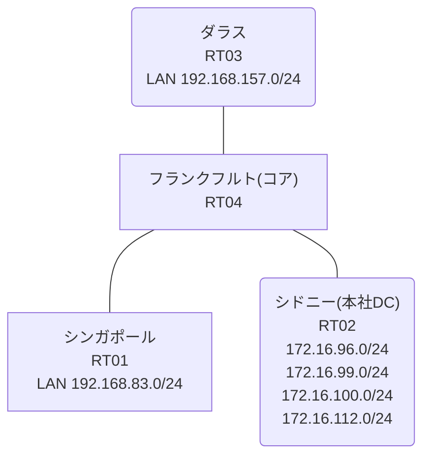

# 問題 20261003-001

> **本問は機器に接続せずに解答すること。追加の show 実行は認めない。**

## 設問

コアのルータにおいて、それぞれのサイトの LAN から、本社のデータ・センターのサービスのネットワークへの転送が、制御されています。コアは、サービスのネットワークへのルーティングの情報を保持しておらず、そして、ポリシーに一致したトラフィックのみが、ネクスト・ホップへ転送されます。ポリシーの対象の指定は、1つのアクセス リストのエントリによって、まかなわれる、そして、シンガポール および ダラス のそれぞれのサイトから、業務のサービスのネットワーク `172.16.96.0/24`・`172.16.99.0/24` へ、到達することができるという条件において、正しいものを、下記から選択しなさい。ルーティング プロトコルの種別およびプロセスの配置は、変更されず、検証および隔離のためのネットワーク `172.16.100.0/24`・`172.16.112.0/24` へは、ポリシーによる転送が、実施されず、PBR が適用されるポイントおよびネクスト・ホップの設計は、変更されないものとします。



リンク一覧:
```
  RT04(.1) ── RT02(.2)   192.168.73.0/29
  RT04(.254) ── RT01      192.168.83.0/24
  RT04(.254) ── RT03      192.168.157.0/24
```

```
RT01# show running-config | section interface|ip route
interface Ethernet0/0
 ip address 192.168.83.1 255.255.255.0
interface Ethernet0/1
 no ip address
 shutdown
interface Ethernet0/2
 no ip address
 shutdown
interface Ethernet0/3
 description === MGMT (Ansible) ===
 vrf forwarding MGMT
 ip address 10.1.10.11 255.255.255.192
ip route 0.0.0.0 0.0.0.0 192.168.83.254
```
```
RT04# show route-map
route-map MAP-A, permit, sequence 10
  Match clauses:
    ip address (access-lists): ACL-A 
  Set clauses:
    ip next-hop 192.168.73.2
  Policy routing matches: 0 packets, 0 bytes
route-map MAP-B, permit, sequence 10
  Match clauses:
    ip address (access-lists): ACL-B 
  Set clauses:
    ip next-hop 192.168.73.2
  Policy routing matches: 5 packets, 570 bytes
```
```
RT02# show running-config | section interface|ip route
interface Loopback0
 ip address 172.16.96.1 255.255.255.0
interface Loopback1
 ip address 172.16.99.1 255.255.255.0
interface Loopback2
 ip address 172.16.100.1 255.255.255.0
interface Loopback3
 ip address 172.16.112.1 255.255.255.0
interface Ethernet0/0
 ip address 192.168.73.2 255.255.255.248
interface Ethernet0/1
 no ip address
 shutdown
interface Ethernet0/2
 no ip address
 shutdown
interface Ethernet0/3
 description === MGMT (Ansible) ===
 vrf forwarding MGMT
 ip address 10.1.10.12 255.255.255.192
ip route 192.168.83.0 255.255.255.0 192.168.73.1
ip route 192.168.157.0 255.255.255.0 192.168.73.1
```
```
RT04# show running-config | section route-map|access-list
ip policy route-map MAP-A
 ip policy route-map MAP-B
ip access-list extended ACL-A
 10 permit ip 172.16.96.0 0.0.3.255 192.168.83.0 0.0.0.255
ip access-list extended ACL-B
 10 permit ip 192.168.157.0 0.0.0.255 172.16.96.0 0.0.3.255
route-map MAP-A permit 10 
 match ip address ACL-A
 set ip next-hop 192.168.73.2
route-map MAP-B permit 10 
 match ip address ACL-B
 set ip next-hop 192.168.73.2
```
```
RT01# ping 172.16.99.1 repeat 5
Type escape sequence to abort.
Sending 5, 100-byte ICMP Echos to 172.16.99.1, timeout is 2 seconds:
.U.U.
Success rate is 0 percent (0/5)
```
```
RT04# show access-lists
Extended IP access list ACL-A
    10 permit ip 172.16.96.0 0.0.3.255 192.168.83.0 0.0.0.255
Extended IP access list ACL-B
    10 permit ip 192.168.157.0 0.0.0.255 172.16.96.0 0.0.3.255 (5 matches)
```
```
RT01# ping 172.16.100.1 repeat 5
Type escape sequence to abort.
Sending 5, 100-byte ICMP Echos to 172.16.100.1, timeout is 2 seconds:
U.U.U
Success rate is 0 percent (0/5)
```
```
RT01# ping 172.16.112.1 repeat 5
Type escape sequence to abort.
Sending 5, 100-byte ICMP Echos to 172.16.112.1, timeout is 2 seconds:
.U.U.
Success rate is 0 percent (0/5)
```
```
RT01# ping 172.16.96.1 repeat 5
Type escape sequence to abort.
Sending 5, 100-byte ICMP Echos to 172.16.96.1, timeout is 2 seconds:
U.U.U
Success rate is 0 percent (0/5)
```
```
RT04# show running-config | section interface
interface Ethernet0/0
 ip address 192.168.73.1 255.255.255.248
interface Ethernet0/1
 ip address 192.168.83.254 255.255.255.0
 ip policy route-map MAP-A
interface Ethernet0/2
 ip address 192.168.157.254 255.255.255.0
 ip policy route-map MAP-B
interface Ethernet0/3
 description === MGMT (Ansible) ===
 vrf forwarding MGMT
 ip address 10.1.10.14 255.255.255.192
```
```
RT03# show running-config | section interface|ip route
interface Ethernet0/0
 ip address 192.168.157.1 255.255.255.0
interface Ethernet0/1
 no ip address
 shutdown
interface Ethernet0/2
 no ip address
 shutdown
interface Ethernet0/3
 description === MGMT (Ansible) ===
 vrf forwarding MGMT
 ip address 10.1.10.13 255.255.255.192
ip route 0.0.0.0 0.0.0.0 192.168.157.254
```
```
RT03# ping 172.16.99.1 repeat 5
Type escape sequence to abort.
Sending 5, 100-byte ICMP Echos to 172.16.99.1, timeout is 2 seconds:
!!!!!
Success rate is 100 percent (5/5), round-trip min/avg/max = 1/1/2 ms
```
```
RT03# ping 172.16.100.1 repeat 5
Type escape sequence to abort.
Sending 5, 100-byte ICMP Echos to 172.16.100.1, timeout is 2 seconds:
U.U.U
Success rate is 0 percent (0/5)
```

## 選択肢

A. MAP-A のシーケンスに match 条件が設定されていない

B. ACL-A の宛先ワイルドカードが、対象ネットワークの一部に一致していない

C. LAN インタフェースに ip policy が適用されていない

D. set ip next-hop の指定が誤っている

E. ACL-A の宛先ワイルドカードが、隔離網まで一致している

F. ACL-A の送信元と宛先の指定が逆になっている
