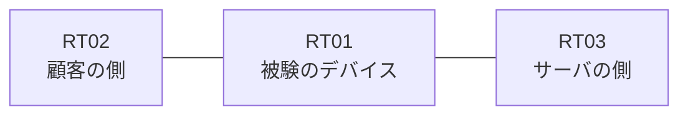

# 問題 20261003-002

> **本問は機器に接続せずに解答すること。追加の show 実行は認めない。**

## 設問

ある企業のネットワークにおいて、RT01 は、顧客の側のネットワークと、サーバの側のネットワークとの間に配置されており、IPv6 によって運用されています。RT01 において、`2001:DB8:58:80::/64`、`2001:DB8:58:81::/64`、`2001:DB8:58:82::/64` のネットワークからの通信のみが、`2001:DB8:58:FF::10` の TCP ポート 443 に到達できるという条件において、必要な設定を、下記の項目から選択しなさい。`2001:DB8:58:83::/64` からの通信は、許可されず、`2001:DB8:58:85::/64` からの通信は、許可されず、管理のための構成に対して、変更が加えられないことが求められます。対象としていないネットワークが、一致の対象に含まれてはなりません。また、エントリの行数は、最小でなければなりません。




## 選択肢

**A.**
```
sequence 10 permit ipv6 2001:DB8:58:80::/63 any
```

**B.**
```
sequence 10 permit ipv6 2001:DB8:58:80::/61 any
```

**C.**
```
sequence 10 deny ipv6 2001:DB8:58:83::/64 any
sequence 20 permit ipv6 2001:DB8:58:80::/62 any
```

**D.**
```
sequence 10 permit ipv6 2001:DB8:58:80::/62 0.0.3.255 any
```

**E.**
```
sequence 10 permit ipv6 2001:DB8:58:80::/62 any
```

**F.**
```
sequence 10 permit ipv6 2001:DB8:58:80::/64 any
sequence 20 permit ipv6 2001:DB8:58:81::/64 any
sequence 30 permit ipv6 2001:DB8:58:82::/64 any
```
