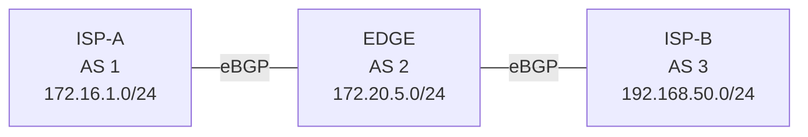

# 問題 20261003-005

> **本問は機器に接続せずに解答すること。追加の show 実行は認めない。**

## シナリオ



ISP-A(AS 1)- EDGE(AS 2)- ISP-B(AS 3)の順に eBGP で接続されています。ISP-A は 172.16.1.0/24、EDGE は 172.20.5.0/24、ISP-B は 192.168.50.0/24 を広告しています。AS 2 を非トランジット AS にしようとしましたが、AS 1 と AS 3 がそれぞれの経路を交換しています。

```
ISP-A# show ip bgp | begin Network
     Network          Next Hop            Metric LocPrf Weight Path
 *>  172.16.1.0/24    0.0.0.0                  0         32768 i
 *>  172.20.5.0/24    10.255.0.2               0             0 2 i
 *>  192.168.50.0/24  10.255.0.2                             0 2 3 i

【EDGE に追加する設定】
EDGE(config)# 【?】
EDGE(config)# router bgp 2
EDGE(config-router)# neighbor 10.255.0.1 prefix-list TO-ISP-A out
EDGE(config-router)# neighbor 10.255.0.6 prefix-list TO-ISP-B out
```

## 設問

AS 1 に AS 3 の経路、AS 3 に AS 1 の経路が届かないようにするために EDGE で必要な【?】に当てはまる設定はどれですか。なお、ISP-A と ISP-B は AS 2 の経路を動的に学習する必要があり、EDGE は AS 1 と AS 3 の経路を動的に学習する必要があります。(1つを選択してください)

## 選択肢

**A.**

```
ip prefix-list TO-ISP-A seq 5 permit 192.168.50.0/24
ip prefix-list TO-ISP-A seq 10 deny 0.0.0.0/0 le 32
ip prefix-list TO-ISP-B seq 5 permit 172.16.1.0/24
ip prefix-list TO-ISP-B seq 10 deny 0.0.0.0/0 le 32
```

**B.**

```
ip prefix-list TO-ISP-A seq 5 deny 192.168.50.0/24
ip prefix-list TO-ISP-A seq 10 permit 0.0.0.0/0 le 32
ip prefix-list TO-ISP-B seq 5 deny 172.16.1.0/24
ip prefix-list TO-ISP-B seq 10 permit 0.0.0.0/0 le 32
```

**C.**

```
ip prefix-list TO-ISP-A seq 5 deny 172.16.1.0/24
ip prefix-list TO-ISP-A seq 10 permit 0.0.0.0/0 le 32
ip prefix-list TO-ISP-B seq 5 deny 192.168.50.0/24
ip prefix-list TO-ISP-B seq 10 permit 0.0.0.0/0 le 32
```

**D.**

```
ip prefix-list TO-ISP-A seq 5 deny 192.168.50.0/24
ip prefix-list TO-ISP-A seq 10 permit 0.0.0.0/0
ip prefix-list TO-ISP-B seq 5 deny 172.16.1.0/24
ip prefix-list TO-ISP-B seq 10 permit 0.0.0.0/0
```
