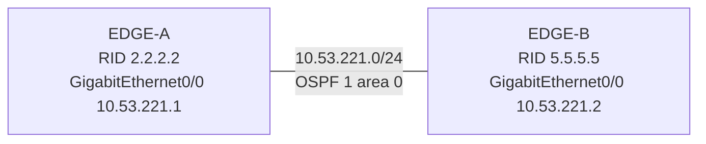

# 問題 20261004-001

> **本問は機器に接続せずに解答すること。追加の show 実行は認めない。**

## シナリオ



EDGE-A と EDGE-B は GigabitEthernet0/0 同士で直接接続され、OSPF プロセス 1 のエリア 0 で隣接を形成する構成です。 隣接が形成されないため、EDGE-A でデバッグを有効にしたところ、次の出力が得られました。

```
EDGE-A# debug ip ospf adj
*Sep 18 03:46:25.000: OSPF-1 ADJ   Gi0/0: Rcv pkt from 10.53.221.2 : Mismatched Authentication Key - Invalid cryptographic authentication Key ID 2 on interface
*Sep 18 03:46:29.548: OSPF-1 HELLO Gi0/0: Send hello to 224.0.0.5 area 0 from 10.53.221.1
*Sep 18 03:46:35.370: OSPF-1 ADJ   Gi0/0: Rcv pkt from 10.53.221.2 : Mismatched Authentication Key - Invalid cryptographic authentication Key ID 2 on interface
```

## 設問

この事象を解消するための変更として最も適切なものは、次のうちどれですか。(1つを選択してください)

## 選択肢

A. EDGE-B の GigabitEthernet0/0 で、鍵 ID 5 に EDGE-A と同じ鍵文字列を構成する(または EDGE-A に鍵 ID 2 を同じ文字列で追加する)。

B. EDGE-B の GigabitEthernet0/0 で ip ospf authentication message-digest を構成する。

C. EDGE-A と EDGE-B の GigabitEthernet0/0 で ip ospf priority をそろえる。

D. EDGE-A の GigabitEthernet0/0 で ip ospf hello-interval を EDGE-B と同じにする。
