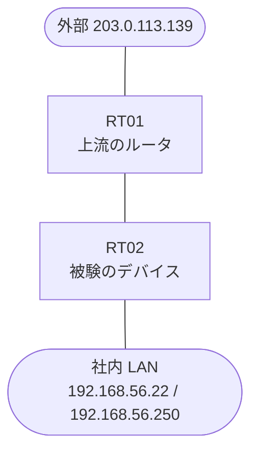

# 問題 20261004-002

> **本問は機器に接続せずに解答すること。追加の show 実行は認めない。**

## 設問

あなたの会社の拠点のルーター RT02 は、上流のルータ RT01 を経由して、外部のネットワークへ接続されています。社内の LAN には、管理のステーション 192.168.56.22 およびサーバ 192.168.56.250 が存在し、そして、RT02 と RT01 の間では、ルーティング・プロトコルの隣接関係が確立されています。RT02 には、コントロール・プレーンを保護するためのサービス・ポリシーが、構成されています。上記以外の、ルーター自身に宛てられたトラフィックは、class-default において帯域が制限され、超過は破棄される、そして、ルータ自身に宛てられたトラフィックの保護は、control-plane の input のサービス・ポリシーによって、実装されるという条件において、下記の項目から、正しいものを選択しなさい。運用のために必要とされる、ルータへの管理のアクセス、および、ルーティング・プロトコルの隣接関係は、影響を受けず、運用のために必要とされる管理のアクセス、および、ルーティング プロトコルのトラフィックは、明示の class によって分類され、いかなる制限も受けず、ルータを通過するところのトラフィックの転送に、影響が与えられず、スタティック・ルートおよび既定のルートによる迂回は、実施されず、特定の用途または発信元ごとの class の追加は、認められていないことが求められます。



| 対象 | 内容 |
|------|------|
| RT02 ⇔ RT01（外部側） | Ethernet0/0・10.63.225.0/30（RT02=10.63.225.1 / RT01=10.63.225.2） |
| RT02 ⇔ 社内 LAN | Ethernet0/1・192.168.56.0/24（RT02=192.168.56.1） |
| 管理のステーション（NMS） | 192.168.56.22（SSH / ping の発信元） |
| サーバ | 192.168.56.250 |
| 外部の発信元 | 203.0.113.139 |

```
RT02# show running-config | section line
line con 0
 logging synchronous
line vty 0 4
 login local
 transport input ssh
```
```
RT02# show policy-map control-plane
Control Plane 

  Service-policy input: PM-CPP

    Class-map: CM-ICMP-LIMIT (match-all)  
      Match: access-group 171
      police:
          cir 8000 bps, bc 1500 bytes
        conformed 0 packets, 0 bytes; actions:
          transmit 
        exceeded 0 packets, 0 bytes; actions:
          drop 
        conformed 0000 bps, exceeded 0000 bps

    Class-map: class-default (match-any)  
      Match: any
```
```
RT02# show access-lists
Extended IP access list 110
    10 permit icmp any any
```
```
RT02# show running-config | section control-plane
control-plane
 service-policy input PM-CPP
```
```
RT02# show running-config | section interface
interface Ethernet0/0
 description === to RT01 ===
 ip address 10.63.225.1 255.255.255.252
interface Ethernet0/1
 ip address 192.168.56.1 255.255.255.0
```

## 選択肢

A. 保護のための明示の class が存在せず、管理およびルーティングのトラフィックが、class-default の制限に道連れにされている

B. サービス・ポリシーが、コントロール・プレーンの output の方向に適用されており、着信するトラフィックに効果を持たない

C. class が match によって参照しているところの番号のアクセス・リストが、定義されていない

D. police の conform のアクションが drop に構成されており、適合するトラフィックまでもが破棄されている

E. police の exceed のアクションが transmit に構成されており、超過するトラフィックが破棄されていない

F. police のバーストの値が構成されていないという理由により、policer が動作していない
