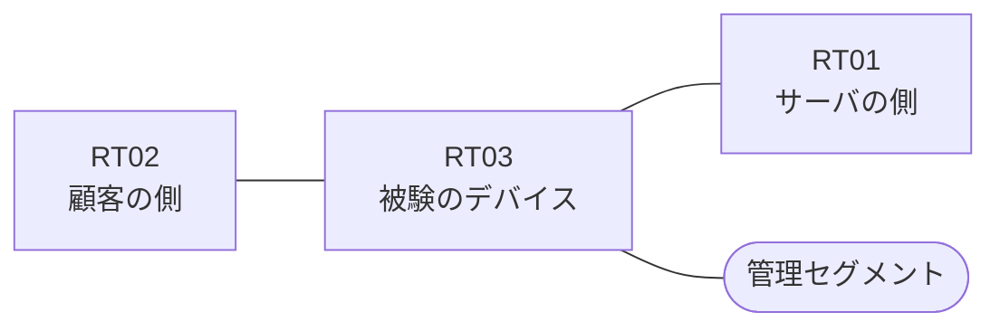

# 問題 20261004-008

> **本問は機器に接続せずに解答すること。追加の show 実行は認めない。**

## トポロジ

あなたは、下記のネットワークの保守を担当する技術者です。ある企業のネットワークにおいて、RT03 は、顧客の側のネットワークと、サーバの側のネットワークとの間に、配置されています。



| 区間 | 被験デバイス側のインターフェイス | ネットワーク |
|------|----------------------------------|--------------|
| RT02（顧客の側） ⇔ RT03 | `Ethernet2/0` | 10.148.253.0/24 |
| RT03 ⇔ RT01（サーバの側） | `Ethernet2/1` | 10.148.254.0/24 |
| RT03 ⇔ 管理セグメント | `Ethernet2/2` | 10.148.255.0/24 |

## 要件

1. アクセス リストは、顧客の側のインターフェイスである `Ethernet2/0` において、着信の方向に適用されなければなりません。
2. アクセス リストのエントリは、1行で構成される必要があります。
3. 本作業は、日中の時間帯において実施されるという理由により、対象外であるところのデバイスに対する構成の変更は、許可されていません。
4. RT03 において、`10.148.96.0/24`、`10.148.97.0/24`、`10.148.98.0/24` のネットワークからの通信が、許可される必要があります。
5. `10.148.101.0/24` からの通信は、許可されてはなりません。

## 現在の状態

いくつかの宛先への通信について、報告が上がっています。示されているところの出力および構成に基づいて、要求されているところの動作が得られていない理由が、判断されなければなりません。

観測 | サーバへの到達
--- | ---
送信元が 10.148.96.0/24 のネットワークにあるホストから、172.22.115.74 の TCP ポート 22 宛ての通信 | 到達可
送信元が 10.148.97.0/24 のネットワークにあるホストから、172.22.115.74 の TCP ポート 22 宛ての通信 | 到達不可
送信元が 10.148.98.0/24 のネットワークにあるホストから、172.22.115.74 の TCP ポート 22 宛ての通信 | 到達不可
送信元が 10.148.99.0/24 のネットワークにあるホストから、172.22.115.74 の TCP ポート 22 宛ての通信 | 到達不可
送信元が 10.148.101.0/24 のネットワークにあるホストから、172.22.115.74 の TCP ポート 22 宛ての通信 | 到達不可
送信元が 10.148.250.0/24 のネットワークにあるホストから、172.22.115.74 の TCP ポート 22 宛ての通信 | 到達不可

```
RT03# show ip access-lists
Standard IP access list 50
    10 permit 10.148.96.0, wildcard bits 0.0.0.255
    20 permit 10.148.96.0, wildcard bits 255.255.252.0
```

## 設定抜粋

```
RT03# show running-config | section ^interface
interface Ethernet2/0
 description === to RT02 ===
 ip address 10.148.253.1 255.255.255.0
 ip access-group 50 in
interface Ethernet2/1
 description === to RT01 ===
 ip address 10.148.254.1 255.255.255.0
interface Ethernet2/2
 description === management ===
 ip address 10.148.255.1 255.255.255.0
```

## 設問

次のうち、正しいものは、どれですか。

## 選択肢
A. インターフェイスに適用されているアクセス・リストが、意図されているものとは別のアクセス・リストである

B. プレフィックス・リストがルート・マップから参照されていない

C. established のキーワードが、戻りの側ではなく、通信を開始する側のアクセス・リストに記述されている

D. インターフェイスが管理上シャットダウンされている

E. ワイルドカードのビットが過剰であり、対象としていないネットワークまでが一致の対象に含まれている

F. ワイルドカードとして記述されている値が、サブネット・マスクの形式になっている
