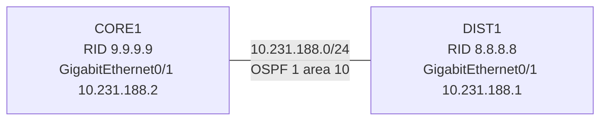

# 問題 20261004-009

> **本問は機器に接続せずに解答すること。追加の show 実行は認めない。**

## シナリオ



CORE1 と DIST1 は GigabitEthernet0/1 同士で直接接続され、OSPF プロセス 1 のエリア 10 で隣接を形成する構成です。 隣接の状態と経路について、次の出力が得られました。

```
CORE1# show ip ospf neighbor

Neighbor ID     Pri   State           Dead Time   Address         Interface

CORE1# show ip ospf interface GigabitEthernet0/1 | include Network Type|Neighbor Count
  Process ID 1, Router ID 9.9.9.9, Network Type POINT_TO_POINT, Cost: 10
  Neighbor Count is 0, Adjacent neighbor count is 0

DIST1# show ip ospf interface GigabitEthernet0/1 | include Network Type|Neighbor Count
  Process ID 1, Router ID 8.8.8.8, Network Type BROADCAST, Cost: 10
  Neighbor Count is 1, Adjacent neighbor count is 1

CORE1# show ip route ospf
(OSPF の経路はありません)
```

## 設問

この事象の原因として最も適切なものは、次のうちどれですか。(1つを選択してください)

## 選択肢

A. CORE1 と DIST1 で同じ鍵 ID を使っているが、鍵の文字列が一致していない。

B. CORE1 と DIST1 の両方で OSPF プライオリティが 0 に設定されている。

C. CORE1 と DIST1 の hello インターバルまたは dead インターバルが一致していない。

D. CORE1 と DIST1 で OSPF のネットワーク タイプが一致していない。
