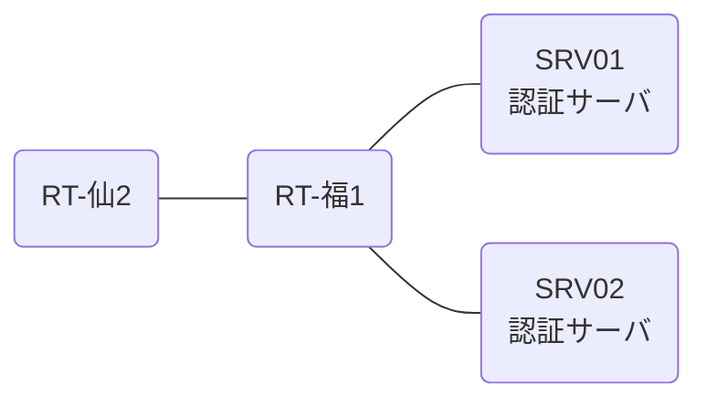

# 問題 20261229-002

> **本問は機器に接続せずに解答すること。追加の show 実行は認めない。**

## トポロジ

あなたの組織は、下記に示されているところのネットワークを運用しています。2 つの拠点のルータが、共通の認証サーバ群を用いて、管理者の認証を行うように構成されています。一方のルータはサーバと直結しており、他方はそのルーターを経由してサーバに到達します。



### 認証サーバの仕様

| 項目 | SRV01 | SRV02 |
|---|---|---|
| アドレス | 10.99.142.2 | 10.99.143.2 |
| 待受ポート | 1812 / 1813 | 1645 / 1646 |
| 共有鍵 | Ccnp-Aaa-77 | Ccnp-Aaa-77 |
| 受理する送信元 | 10.0.0.1 ・ 10.6.0.2 | 同左 |
| 台帳 | noc-taro(15) ・ helpdesk(1) ・ SUZUKI(15) | 同左 |
| 現在の稼働状態 | 保守作業のため停止中 | 稼働中 |

### ルータのアドレス

| ルータ | Loopback0 | 認証サーバ方向のインタフェース |
|---|---|---|
| RT-福1(福岡) | 10.0.0.1 | Ethernet0/0 = 10.99.142.1 |
| RT-仙2(仙台) | 10.6.0.2 | Ethernet0/0 = 10.75.12.2 |

## 要件

1. 福岡・仙台 の両拠点で、利用者 noc-taro が権限レベル 15 で機器を操作できること。
2. 緊急時にコンソールから操作できる経路を失わないこと。
3. 運用者の遠隔からの接続が失われないこと。
4. 認証は認証サーバ群 NOC-RADIUS を用いること。

## 現在の状態

いくつかの宛先への通信について、報告が上がっています。示されているところの出力および構成に基づいて、要求されているところの動作が得られていない理由が、判断されなければなりません。

| 拠点 | ユーザ | 結果 |
|---|---|---|
| 福岡 | noc-taro | ログイン可(権限レベル 15) |
| 福岡 | helpdesk | ログイン可(権限レベル 1) |
| 福岡 | break-glass | ログイン不可 |
| 福岡 | helpdesk からの特権昇格 | 昇格可(15) |
| 福岡 | noc-taro(6 セッション目以降) | ログイン可(権限レベル 15) |
| 福岡 | break-glass(コンソールから) | ログイン可(権限レベル 15) |
| 仙台 | noc-taro | ログイン可(権限レベル 15) |
| 仙台 | helpdesk | ログイン可(権限レベル 1) |
| 仙台 | break-glass | ログイン不可 |
| 仙台 | helpdesk からの特権昇格 | 昇格可(15) |
| 仙台 | noc-taro(6 セッション目以降) | ログイン不可 |
| 仙台 | break-glass(コンソールから) | ログイン可(権限レベル 15) |

認証サーバがすべて停止した場合:

| 拠点 | ユーザ | 結果 |
|---|---|---|
| 福岡 | break-glass | ログイン可(権限レベル 15) |
| 福岡 | SUZUKI | ログイン可(権限レベル 15) |
| 福岡 | break-glass(コンソールから) | ログイン可(権限レベル 15) |
| 仙台 | break-glass | ログイン可(権限レベル 15) |
| 仙台 | SUZUKI | ログイン可(権限レベル 15) |
| 仙台 | break-glass(コンソールから) | ログイン可(権限レベル 15) |


## 設定抜粋

```
RT-福1# show running-config | section aaa
aaa new-model
!
radius server RAD1
 address ipv4 10.99.142.2 auth-port 1812 acct-port 1813
 key Ccnp-Aaa-77
!
radius server RAD2
 address ipv4 10.99.143.2 auth-port 1645 acct-port 1646
 key Ccnp-Aaa-77
!
aaa group server radius NOC-RADIUS
 server name RAD1
 server name RAD2
 deadtime 5
!
aaa authentication login default group NOC-RADIUS local
aaa authentication login CONSOLE local
aaa authorization exec default group NOC-RADIUS local
aaa authorization exec CONSOLE local
aaa authorization console
!
ip radius source-interface Loopback0
radius-server timeout 5
radius-server retransmit 2
!
username break-glass privilege 15 secret 5 $1$xxxx
username SUZUKI privilege 15 secret 5 $1$yyyy
!
line con 0
 exec-timeout 0 0
 logging synchronous
 login authentication CONSOLE
 authorization exec CONSOLE
line vty 0 4
 exec-timeout 0 0
 transport input ssh
line vty 5 15
 exec-timeout 0 0
 transport input ssh
```
```
RT-仙2# show running-config | section aaa
aaa new-model
!
radius server RAD1
 address ipv4 10.99.142.2 auth-port 1812 acct-port 1813
 key Ccnp-Aaa-77
!
radius server RAD2
 address ipv4 10.99.143.2 auth-port 1645 acct-port 1646
 key Ccnp-Aaa-77
!
aaa group server radius NOC-RADIUS
 server name RAD1
 server name RAD2
 deadtime 5
!
aaa authentication login default local
aaa authentication login CONSOLE local
aaa authentication login REMOTE group NOC-RADIUS local
aaa authorization exec default group NOC-RADIUS local
aaa authorization exec CONSOLE local
aaa authorization console
!
ip radius source-interface Loopback0
radius-server timeout 5
radius-server retransmit 2
!
username break-glass privilege 15 secret 5 $1$xxxx
username SUZUKI privilege 15 secret 5 $1$yyyy
!
line con 0
 exec-timeout 0 0
 logging synchronous
 login authentication CONSOLE
 authorization exec CONSOLE
line vty 0 4
 exec-timeout 0 0
 login authentication REMOTE
 transport input ssh
line vty 5 15
 exec-timeout 0 0
 transport input ssh
```

## 設問

次のうち、正しいものは、どれですか。

## 選択肢
**A.**
```
福岡: User was successfully authenticated. (約 15 秒)
仙台: No authoritative response from any server. (約 30 秒)
```
**B.**
```
福岡: User authentication request was rejected by server. (約 15 秒)
仙台: User authentication request was rejected by server. (約 15 秒)
```
**C.**
```
福岡: User was successfully authenticated. (約 15 秒)
仙台: User was successfully authenticated. (約 15 秒)
```
