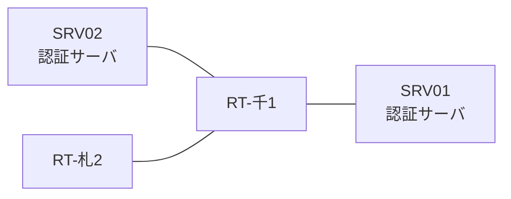

# 問題 20261229-004

> **本問は機器に接続せずに解答すること。追加の show 実行は認めない。**

## シナリオ

あなたは、ネットワークの運用を担当しています。2 つの拠点のルータが、共通の認証サーバ群を用いて、管理者の認証を行うように構成されています。一方のルータはサーバと直結しており、他方はそのルーターを経由してサーバに到達します。一部の通信が、意図されているとおりに動作していない、という報告があります。あなたは、提示されているところの情報のみを使用して、要求されている状態が満たされていない理由を、特定しなければなりません。千葉・札幌 の両拠点で、利用者 noc-hanako が権限レベル 15 で機器を操作できること。認証サーバが全て停止した場合でも、コンソールからは操作できること。認証は認証サーバ群 AUTH-GRP を用いること。



### 認証サーバの仕様

| 項目 | SRV01 | SRV02 |
|---|---|---|
| アドレス | 10.99.186.2 | 10.99.187.2 |
| 待受ポート | 1812 / 1813 | 1645 / 1646 |
| 共有鍵 | K-9931 | K-9931 |
| 受理する送信元 | 10.6.0.1 ・ 10.9.0.2 | 同左 |
| 台帳 | noc-hanako(15) ・ monitor-op(1) ・ SUZUKI(15) | 同左 |
| 現在の稼働状態 | 稼働中 | 稼働中 |

### ルータのアドレス

| ルータ | Loopback0 | 認証サーバ方向のインタフェース |
|---|---|---|
| RT-千1(千葉) | 10.6.0.1 | Ethernet0/0 = 10.99.186.1 |
| RT-札2(札幌) | 10.9.0.2 | Ethernet0/0 = 10.44.12.2 |

## 出力

| 拠点 | ユーザ | 結果 |
|---|---|---|
| 千葉 | noc-hanako | ログイン可(権限レベル 15) |
| 千葉 | monitor-op | ログイン可(権限レベル 1) |
| 千葉 | break-glass | ログイン不可 |
| 千葉 | monitor-op からの特権昇格 | 昇格可(15) |
| 千葉 | noc-hanako(6 セッション目以降) | ログイン可(権限レベル 15) |
| 千葉 | break-glass(コンソールから) | ログイン可(権限レベル 15) |
| 札幌 | noc-hanako | ログイン不可 |
| 札幌 | monitor-op | ログイン不可 |
| 札幌 | break-glass | ログイン可(権限レベル 15) |
| 札幌 | noc-hanako(6 セッション目以降) | ログイン不可 |
| 札幌 | break-glass(コンソールから) | ログイン可(権限レベル 15) |

認証サーバがすべて停止した場合:

| 拠点 | ユーザ | 結果 |
|---|---|---|
| 千葉 | break-glass | ログイン可(権限レベル 15) |
| 千葉 | SUZUKI | ログイン可(権限レベル 15) |
| 千葉 | break-glass(コンソールから) | ログイン可(権限レベル 15) |
| 札幌 | break-glass | ログイン可(権限レベル 15) |
| 札幌 | SUZUKI | ログイン可(権限レベル 15) |
| 札幌 | break-glass(コンソールから) | ログイン可(権限レベル 15) |

```
千葉: User was successfully authenticated. (即時)
札幌: No authoritative response from any server. (約 12 秒)
```
```
RT-千1# show running-config | section aaa
aaa new-model
!
radius server RAD1
 address ipv4 10.99.186.2 auth-port 1812 acct-port 1813
 key K-9931
!
radius server RAD2
 address ipv4 10.99.187.2 auth-port 1645 acct-port 1646
 key K-9931
!
aaa group server radius AUTH-GRP
 server name RAD1
 server name RAD2
 deadtime 5
!
aaa authentication login default group AUTH-GRP local
aaa authentication login CONSOLE local
aaa authorization exec default group AUTH-GRP local
aaa authorization exec CONSOLE local
aaa authorization console
!
ip radius source-interface Loopback0
radius-server timeout 3
radius-server retransmit 1
!
username break-glass privilege 15 secret 5 $1$xxxx
username SUZUKI privilege 15 secret 5 $1$yyyy
!
line con 0
 exec-timeout 0 0
 logging synchronous
 login authentication CONSOLE
 authorization exec CONSOLE
line vty 0 4
 exec-timeout 0 0
 transport input ssh
line vty 5 15
 exec-timeout 0 0
 transport input ssh
```
```
RT-札2# show running-config | section aaa
aaa new-model
!
radius server RAD1
 address ipv4 10.99.186.2 auth-port 1812 acct-port 1813
 key K-9931
!
radius server RAD2
 address ipv4 10.99.187.2 auth-port 1645 acct-port 1646
 key K-9931
!
aaa group server radius AUTH-GRP
 server name RAD1
 server name RAD2
 deadtime 5
!
aaa authentication login default group AUTH-GRP local
aaa authentication login CONSOLE local
aaa authorization exec default group AUTH-GRP local
aaa authorization exec CONSOLE local
aaa authorization console
!
ip radius source-interface Loopback0
radius-server timeout 3
radius-server retransmit 1
!
username break-glass privilege 15 secret 5 $1$xxxx
username SUZUKI privilege 15 secret 5 $1$yyyy
!
ip access-list extended BORDER-IN
 deny   udp any any eq 1645
 deny   udp any any eq 1812
 permit ip any any
!
interface Ethernet0/0
 ip access-group BORDER-IN out
!
line con 0
 exec-timeout 0 0
 logging synchronous
 login authentication CONSOLE
 authorization exec CONSOLE
line vty 0 4
 exec-timeout 0 0
 transport input ssh
line vty 5 15
 exec-timeout 0 0
 transport input ssh
```

## 設問

次のうち、正しいものは、どれですか。

## 選択肢
A. アクセスリストが、認証要求の送信を遮断している。

B. 方式リストが、一部の vty 回線にしか適用されていない。

C. ルータが指定している待受ポートがサーバの実際の値と異なる。

D. exec の認可の代替手段が、権限レベルを与えないものになっている。
