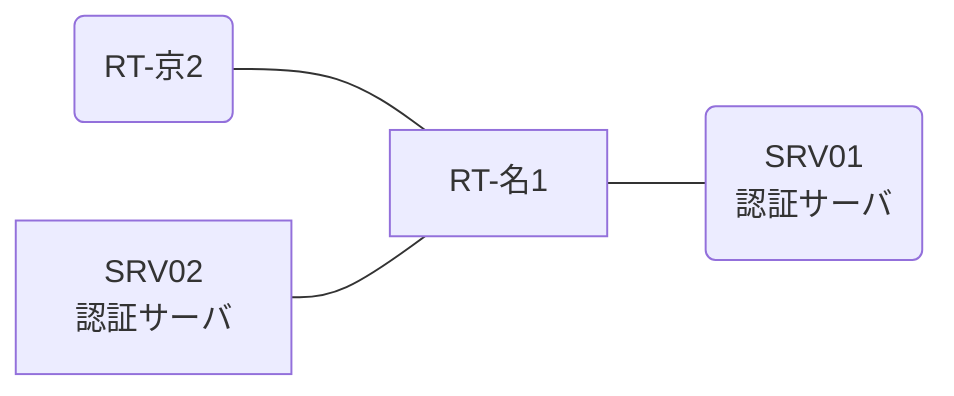

# 問題 20261229-014

> **本問は機器に接続せずに解答すること。追加の show 実行は認めない。**

## トポロジ

あなたは、ネットワークの運用を担当しています。2 つの拠点のルータが、共通の認証サーバ群を用いて、管理者の認証を行うように構成されています。一方のルータはサーバと直結しており、他方はそのルーターを経由してサーバに到達します。



### 認証サーバの仕様

| 項目 | SRV01 | SRV02 |
|---|---|---|
| アドレス | 10.99.17.2 | 10.99.18.2 |
| 待受ポート | 1812 / 1813 | 11812 / 11813 |
| 共有鍵 | Rad-8102 | Rad-8102 |
| 受理する送信元 | 10.4.0.1 ・ 10.3.0.2 | 同左 |
| 台帳 | ope-suzuki(15) ・ watch-op(1) ・ SUZUKI(15) | 同左 |
| 現在の稼働状態 | 保守作業のため停止中 | 稼働中 |

### ルータのアドレス

| ルータ | Loopback0 | 認証サーバ方向のインタフェース |
|---|---|---|
| RT-名1(名古屋) | 10.4.0.1 | Ethernet0/0 = 10.99.17.1 |
| RT-京2(京都) | 10.3.0.2 | Ethernet0/0 = 10.97.12.2 |

## 要件

1. 名古屋・京都 の両拠点で、利用者 ope-suzuki が権限レベル 15 で機器を操作できること。
2. 既定の方式リストは変更しないこと。
3. 認証は認証サーバ群 AAA-SRV を用いること。

## 現在の状態

特権レベルへの昇格が試行された際の、デバッグの出力が、採取されました。

```
RT-名1# debug aaa authentication
AAA/AUTHEN/START (1560798390): port='tty3' list='' action=LOGIN service=ENABLE
AAA/AUTHEN/START (1560798390): using "default" list
AAA/AUTHEN/START (1560798390): Method=AAA-SRV (radius)
AAA/AUTHEN (1560798390): status = GETPASS
AAA/AUTHEN/CONT (1560798390): continue_login (user='<利用者>')
AAA/AUTHEN (1560798390): status = GETPASS
AAA/AUTHEN/CONT (1560798390): Method=AAA-SRV (radius)
AAA/AUTHEN (1560798390): status = FAIL
```

## 設定抜粋

```
RT-名1# show running-config | section aaa
aaa new-model
!
aaa group server radius AAA-SRV
 server name RAD1
 server name RAD2
 deadtime 5
!
aaa authentication enable default group AAA-SRV enable
enable secret 5 $1$aaaa
radius-server timeout 3
radius-server retransmit 2
```

## 設問

示されているところの出力について、正しい記述は、どれですか。(2つを選択してください)

## 選択肢
A. 特権レベルへの昇格は失敗している。

B. method1 として認証サーバ群 AAA-SRV への問い合わせが行われ、サーバから拒否されている。

C. 特権レベルへの昇格の認証について、方式リストが構成されていない。

D. method2 として enable パスワードによる認証が試行され、失敗している。
