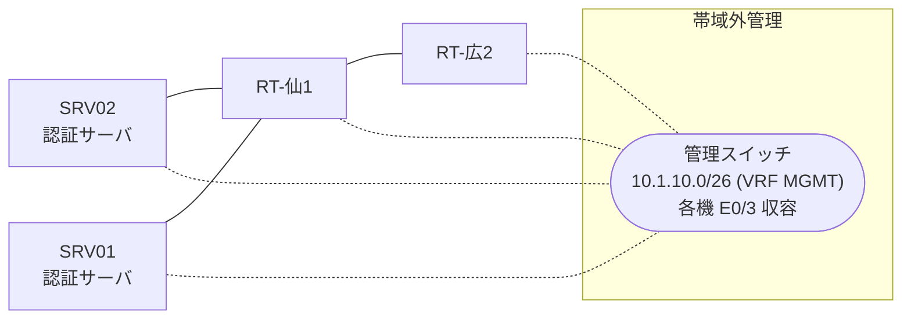

# 問題 20261229-018

> **本問は機器に接続せずに解答すること。追加の show 実行は認めない。**

## トポロジ

あなたは、ネットワークの運用を担当しています。2 つの拠点のルータが、共通の認証サーバ群を用いて、管理者の認証を行うように構成されています。一方のルータはサーバと直結しており、他方はそのルーターを経由してサーバに到達します。



### 認証サーバの仕様

| 項目 | SRV01 | SRV02 |
|---|---|---|
| アドレス | 10.99.146.2 | 10.99.147.2 |
| 待受ポート | 1812 / 1813 | 1912 / 1913 |
| 共有鍵 | Ccnp-Aaa-77 | Ccnp-Aaa-77 |
| 受理する送信元 | 10.6.0.1 ・ 10.8.0.2 | 同左 |
| 台帳 | ope-suzuki(15) ・ desk-01(1) ・ SUZUKI(15) | 同左 |
| 現在の稼働状態 | 保守作業のため停止中 | 稼働中 |

### ルータのアドレス

| ルータ | Loopback0 | 認証サーバ方向のインタフェース |
|---|---|---|
| RT-仙1(仙台) | 10.6.0.1 | Ethernet0/0 = 10.99.146.1 |
| RT-広2(広島) | 10.8.0.2 | Ethernet0/0 = 10.26.12.2 |

## 要件

1. 仙台・広島 の両拠点で、利用者 ope-suzuki が権限レベル 15 で機器を操作できること。
2. 認証は認証サーバ群 AAA-SRV を用いること。
3. 認証サーバが全て停止した場合でも、コンソールからは操作できること。

## 現在の状態

通信の一部において、想定されていない挙動が、観測されています。あなたは、示されているところの出力および構成に基づいて、その構成が、下記において記述されているとおりに動作していない理由を、判断する必要があります。

| 拠点 | ユーザ | 結果 |
|---|---|---|
| 仙台 | ope-suzuki | ログイン可(権限レベル 15) |
| 仙台 | desk-01 | ログイン可(権限レベル 1) |
| 仙台 | local-admin | ログイン不可 |
| 仙台 | desk-01 からの特権昇格 | 昇格可(15) |
| 仙台 | ope-suzuki(6 セッション目以降) | ログイン可(権限レベル 15) |
| 仙台 | local-admin(コンソールから) | ログイン可(権限レベル 15) |
| 広島 | ope-suzuki | ログイン不可 |
| 広島 | desk-01 | ログイン不可 |
| 広島 | local-admin | ログイン可(権限レベル 15) |
| 広島 | ope-suzuki(6 セッション目以降) | ログイン不可 |
| 広島 | local-admin(コンソールから) | ログイン可(権限レベル 15) |

認証サーバがすべて停止した場合:

| 拠点 | ユーザ | 結果 |
|---|---|---|
| 仙台 | local-admin | ログイン可(権限レベル 15) |
| 仙台 | SUZUKI | ログイン可(権限レベル 15) |
| 仙台 | local-admin(コンソールから) | ログイン可(権限レベル 15) |
| 広島 | local-admin | ログイン可(権限レベル 15) |
| 広島 | SUZUKI | ログイン可(権限レベル 15) |
| 広島 | local-admin(コンソールから) | ログイン可(権限レベル 15) |

```
仙台: User was successfully authenticated. (約 6 秒)
広島: No authoritative response from any server. (約 12 秒)
```

## 設定抜粋

```
RT-仙1# show running-config | section aaa
aaa new-model
!
radius server RAD1
 address ipv4 10.99.146.2 auth-port 1812 acct-port 1813
 key Ccnp-Aaa-77
!
radius server RAD2
 address ipv4 10.99.147.2 auth-port 1912 acct-port 1913
 key Ccnp-Aaa-77
!
aaa group server radius AAA-SRV
 server name RAD1
 server name RAD2
 deadtime 5
!
aaa authentication login default group AAA-SRV local
aaa authentication login CONSOLE local
aaa authorization exec default group AAA-SRV local
aaa authorization exec CONSOLE local
aaa authorization console
!
ip radius source-interface Loopback0
radius-server timeout 3
radius-server retransmit 1
!
username local-admin privilege 15 secret 5 $1$xxxx
username SUZUKI privilege 15 secret 5 $1$yyyy
!
line con 0
 exec-timeout 0 0
 logging synchronous
 login authentication CONSOLE
 authorization exec CONSOLE
line vty 0 4
 exec-timeout 0 0
 transport input ssh
line vty 5 15
 exec-timeout 0 0
 transport input ssh
```
```
RT-広2# show running-config | section aaa
aaa new-model
!
radius server RAD1
 address ipv4 10.99.146.2 auth-port 1812 acct-port 1813
 key Ccnp-Aaa-77
!
radius server RAD2
 address ipv4 10.99.147.2 auth-port 1912 acct-port 1913
 key Ccnp-Aaa-77
!
aaa group server radius AAA-SRV
 server name RAD1
 server name RAD2
 deadtime 5
!
aaa authentication login default group AAA-SRV local
aaa authentication login CONSOLE local
aaa authorization exec default group AAA-SRV local
aaa authorization exec CONSOLE local
aaa authorization console
!
ip radius source-interface Loopback0
radius-server timeout 3
radius-server retransmit 1
!
username local-admin privilege 15 secret 5 $1$xxxx
username SUZUKI privilege 15 secret 5 $1$yyyy
!
ip access-list extended MGMT-GUARD
 deny   udp any eq 1812 any
 deny   udp any eq 1912 any
 permit ip any any
!
interface Ethernet0/0
 ip access-group MGMT-GUARD in
!
line con 0
 exec-timeout 0 0
 logging synchronous
 login authentication CONSOLE
 authorization exec CONSOLE
line vty 0 4
 exec-timeout 0 0
 transport input ssh
line vty 5 15
 exec-timeout 0 0
 transport input ssh
```

## 設問

次のうち、正しいものは、どれですか。

## 選択肢
A. コンソール回線に対する認可が有効化されていない。

B. 回線が参照している方式リストが定義されていない。

C. アクセスリストが、認証サーバからの応答を遮断している。

D. ルータが指定している待受ポートがサーバの実際の値と異なる。
