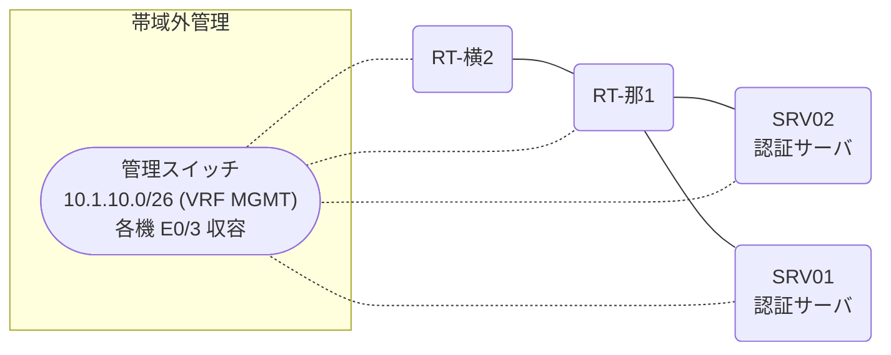

# 問題 20261229-019

> **本問は機器に接続せずに解答すること。追加の show 実行は認めない。**

## トポロジ

あなたは、下記のネットワークの保守を担当する技術者です。2 つの拠点のルータが、共通の認証サーバ群を用いて、管理者の認証を行うように構成されています。一方のルータはサーバと直結しており、他方はそのルーターを経由してサーバに到達します。



### 認証サーバの仕様

| 項目 | SRV01 | SRV02 |
|---|---|---|
| アドレス | 10.99.225.2 | 10.99.226.2 |
| 待受ポート | 1812 / 1813 | 11812 / 11813 |
| 共有鍵 | Sh4red-Key | Sh4red-Key |
| 受理する送信元 | 10.6.0.1 ・ 10.6.0.2 | 同左 |
| 台帳 | noc-taro(15) ・ watch-op(1) ・ SUZUKI(15) | 同左 |
| 現在の稼働状態 | 保守作業のため停止中 | 保守作業のため停止中 |

### ルータのアドレス

| ルータ | Loopback0 | 認証サーバ方向のインタフェース |
|---|---|---|
| RT-那1(那覇) | 10.6.0.1 | Ethernet0/0 = 10.99.225.1 |
| RT-横2(横浜) | 10.6.0.2 | Ethernet0/0 = 10.72.12.2 |

## 要件

1. 那覇・横浜 の両拠点で、利用者 noc-taro が権限レベル 15 で機器を操作できること。
2. 認証は認証サーバ群 RAD-GROUP を用いること。
3. 認証サーバが全て停止した場合でも、コンソールからは操作できること。

## 現在の状態

特権レベルへの昇格が試行された際の、デバッグの出力が、採取されました。

```
RT-那1# debug aaa authentication
AAA/AUTHEN/START (1560798390): port='tty3' list='' action=LOGIN service=ENABLE
AAA/AUTHEN/START (1560798390): using "default" list
AAA/AUTHEN/START (1560798390): Method=RAD-GROUP (radius)
AAA/AUTHEN (1560798390): status = GETPASS
AAA/AUTHEN/CONT (1560798390): continue_login (user='<利用者>')
AAA/AUTHEN (1560798390): status = GETPASS
AAA/AUTHEN/CONT (1560798390): Method=RAD-GROUP (radius)
AAA/AUTHEN (1560798390): status = ERROR
AAA/AUTHEN/START (1560798391): port='tty3' list='' action=LOGIN service=ENABLE
AAA/AUTHEN/START (1560798391): Restart
AAA/AUTHEN/START (1560798391): Method=ENABLE
AAA/AUTHEN (1560798391): status = GETPASS
AAA/AUTHEN/CONT (1560798391): continue_login (user='(undef)')
AAA/AUTHEN (1560798391): status = GETPASS
AAA/AUTHEN/CONT (1560798391): Method=ENABLE
AAA/AUTHEN (1560798391): status = PASS
```

## 設定抜粋

```
RT-那1# show running-config | section aaa
aaa new-model
!
aaa group server radius RAD-GROUP
 server name RAD1
 server name RAD2
 deadtime 5
!
aaa authentication enable default group RAD-GROUP enable
enable secret 5 $1$aaaa
radius-server timeout 3
radius-server retransmit 2
```

## 設問

示されているところの出力について、正しい記述は、どれですか。(2つを選択してください)

## 選択肢
A. 特権レベルへの昇格は成功している。

B. この操作は、コンソール以外の回線から行われている。

C. 特権レベルへの昇格の認証について、方式リストが構成されていない。

D. method1 として認証サーバ群 RAD-GROUP への問い合わせが行われ、サーバから拒否されている。
