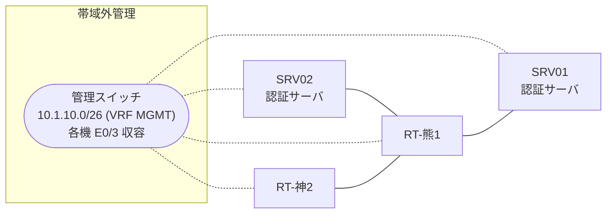

# 問題 20261229-023

> **本問は機器に接続せずに解答すること。追加の show 実行は認めない。**

## トポロジ

あなたの組織は、下記に示されているところのネットワークを運用しています。2 つの拠点のルータが、共通の認証サーバ群を用いて、管理者の認証を行うように構成されています。一方のルータはサーバと直結しており、他方はそのルーターを経由してサーバに到達します。



### 認証サーバの仕様

| 項目 | SRV01 | SRV02 |
|---|---|---|
| アドレス | 10.99.153.2 | 10.99.154.2 |
| 待受ポート | 1812 / 1813 | 11812 / 11813 |
| 共有鍵 | Rad-8102 | Rad-8102 |
| 受理する送信元 | 10.2.0.1 ・ 10.7.0.2 | 同左 |
| 台帳 | netadmin(15) ・ monitor-op(1) ・ SUZUKI(15) | 同左 |
| 現在の稼働状態 | 保守作業のため停止中 | 稼働中 |

### ルータのアドレス

| ルータ | Loopback0 | 認証サーバ方向のインタフェース |
|---|---|---|
| RT-熊1(熊本) | 10.2.0.1 | Ethernet0/0 = 10.99.153.1 |
| RT-神2(神戸) | 10.7.0.2 | Ethernet0/0 = 10.39.12.2 |

## 要件

1. 熊本・神戸 の両拠点で、利用者 netadmin が権限レベル 15 で機器を操作できること。
2. 緊急時にコンソールから操作できる経路を失わないこと。
3. 認証は認証サーバ群 RADGRP を用いること。
4. 運用者の遠隔からの接続が失われないこと。

## 現在の状態

通信の一部において、想定されていない挙動が、観測されています。あなたは、提示されているところの情報のみを使用して、要求されている状態が満たされていない理由を、特定しなければなりません。

| 拠点 | ユーザ | 結果 |
|---|---|---|
| 熊本 | netadmin | ログイン可(権限レベル 15) |
| 熊本 | monitor-op | ログイン可(権限レベル 1) |
| 熊本 | backup-adm | ログイン不可 |
| 熊本 | monitor-op からの特権昇格 | 昇格可(15) |
| 熊本 | netadmin(6 セッション目以降) | ログイン可(権限レベル 15) |
| 熊本 | backup-adm(コンソールから) | ログイン可(権限レベル 15) |
| 神戸 | netadmin | ログイン可(権限レベル 15) |
| 神戸 | monitor-op | ログイン可(権限レベル 1) |
| 神戸 | backup-adm | ログイン不可 |
| 神戸 | monitor-op からの特権昇格 | 昇格可(15) |
| 神戸 | netadmin(6 セッション目以降) | ログイン可(権限レベル 15) |
| 神戸 | backup-adm(コンソールから) | ログイン可(権限レベル 1) |

認証サーバがすべて停止した場合:

| 拠点 | ユーザ | 結果 |
|---|---|---|
| 熊本 | backup-adm | ログイン可(権限レベル 15) |
| 熊本 | SUZUKI | ログイン可(権限レベル 15) |
| 熊本 | backup-adm(コンソールから) | ログイン可(権限レベル 15) |
| 神戸 | backup-adm | ログイン可(権限レベル 15) |
| 神戸 | SUZUKI | ログイン可(権限レベル 15) |
| 神戸 | backup-adm(コンソールから) | ログイン可(権限レベル 1) |


## 設定抜粋

```
RT-熊1# show running-config | section aaa
aaa new-model
!
radius server RAD1
 address ipv4 10.99.153.2 auth-port 1812 acct-port 1813
 key Rad-8102
!
radius server RAD2
 address ipv4 10.99.154.2 auth-port 11812 acct-port 11813
 key Rad-8102
!
aaa group server radius RADGRP
 server name RAD1
 server name RAD2
 deadtime 5
!
aaa authentication login default group RADGRP local
aaa authentication login CONSOLE local
aaa authorization exec default group RADGRP local
aaa authorization exec CONSOLE local
aaa authorization console
!
ip radius source-interface Loopback0
radius-server timeout 2
radius-server retransmit 1
!
username backup-adm privilege 15 secret 5 $1$xxxx
username SUZUKI privilege 15 secret 5 $1$yyyy
!
line con 0
 exec-timeout 0 0
 logging synchronous
 login authentication CONSOLE
 authorization exec CONSOLE
line vty 0 4
 exec-timeout 0 0
 transport input ssh
line vty 5 15
 exec-timeout 0 0
 transport input ssh
```
```
RT-神2# show running-config | section aaa
aaa new-model
!
radius server RAD1
 address ipv4 10.99.153.2 auth-port 1812 acct-port 1813
 key Rad-8102
!
radius server RAD2
 address ipv4 10.99.154.2 auth-port 11812 acct-port 11813
 key Rad-8102
!
aaa group server radius RADGRP
 server name RAD1
 server name RAD2
 deadtime 5
!
aaa authentication login default group RADGRP local
aaa authentication login CONSOLE local
aaa authorization exec default group RADGRP local
aaa authorization exec CONSOLE local
!
ip radius source-interface Loopback0
radius-server timeout 2
radius-server retransmit 1
!
username backup-adm privilege 15 secret 5 $1$xxxx
username SUZUKI privilege 15 secret 5 $1$yyyy
!
line con 0
 exec-timeout 0 0
 logging synchronous
 login authentication CONSOLE
 authorization exec CONSOLE
line vty 0 4
 exec-timeout 0 0
 transport input ssh
line vty 5 15
 exec-timeout 0 0
 transport input ssh
```

## 設問

次のうち、正しいものは、どれですか。

## 選択肢
**A.**
```
熊本: User was successfully authenticated. (約 4 秒)
神戸: User was successfully authenticated. (約 4 秒)
```
**B.**
```
熊本: User was successfully authenticated. (約 4 秒)
神戸: No authoritative response from any server. (約 8 秒)
```
**C.**
```
熊本: User authentication request was rejected by server. (約 4 秒)
神戸: User authentication request was rejected by server. (約 4 秒)
```
