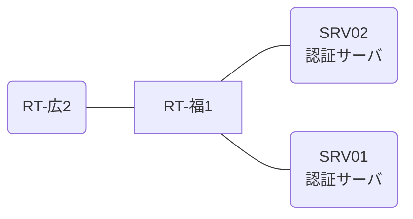

# 問題 20261229-024

> **本問は機器に接続せずに解答すること。追加の show 実行は認めない。**

## シナリオ

あなたは、ネットワークの運用を担当しています。2 つの拠点のルータが、共通の認証サーバ群を用いて、管理者の認証を行うように構成されています。一方のルータはサーバと直結しており、他方はそのルーターを経由してサーバに到達します。特権レベルへの昇格が試行された際の、デバッグの出力が、採取されました。福岡・広島 の両拠点で、利用者 noc-taro が権限レベル 15 で機器を操作できること。認証は認証サーバ群 AUTH-GRP を用いること。認証サーバが全て停止した場合でも、コンソールからは操作できること。



### 認証サーバの仕様

| 項目 | SRV01 | SRV02 |
|---|---|---|
| アドレス | 10.99.88.2 | 10.99.89.2 |
| 待受ポート | 1812 / 1813 | 11812 / 11813 |
| 共有鍵 | K-9931 | K-9931 |
| 受理する送信元 | 10.8.0.1 ・ 10.9.0.2 | 同左 |
| 台帳 | noc-taro(15) ・ watch-op(1) ・ SUZUKI(15) | 同左 |
| 現在の稼働状態 | 稼働中 | 稼働中 |

### ルータのアドレス

| ルータ | Loopback0 | 認証サーバ方向のインタフェース |
|---|---|---|
| RT-福1(福岡) | 10.8.0.1 | Ethernet0/0 = 10.99.88.1 |
| RT-広2(広島) | 10.9.0.2 | Ethernet0/0 = 10.95.12.2 |

## 出力

```
RT-福1# show running-config | section aaa
aaa new-model
!
aaa group server radius AUTH-GRP
 server name RAD1
 server name RAD2
 deadtime 5
!
aaa authentication enable default group AUTH-GRP enable
enable secret 5 $1$aaaa
radius-server timeout 3
radius-server retransmit 1
```
```
RT-福1# debug aaa authentication
AAA/AUTHEN/START (1560798390): port='con 0' list='' action=LOGIN service=ENABLE
AAA/AUTHEN/START (1560798390): using "default" list
AAA/AUTHEN/START (1560798390): Method=AUTH-GRP (radius)
AAA/AUTHEN (1560798390): status = GETPASS
AAA/AUTHEN/CONT (1560798390): continue_login (user='<利用者>')
AAA/AUTHEN (1560798390): status = GETPASS
AAA/AUTHEN/CONT (1560798390): Method=AUTH-GRP (radius)
AAA/AUTHEN (1560798390): status = FAIL
```

## 設問

示されているところの出力について、正しい記述は、どれですか。(2つを選択してください)

## 選択肢
A. この操作は、コンソール以外の回線から行われている。

B. 特権レベルへの昇格は失敗している。

C. method1 として認証サーバ群 AUTH-GRP への問い合わせが行われ、応答が得られていない。

D. method2 は試行されていない。
