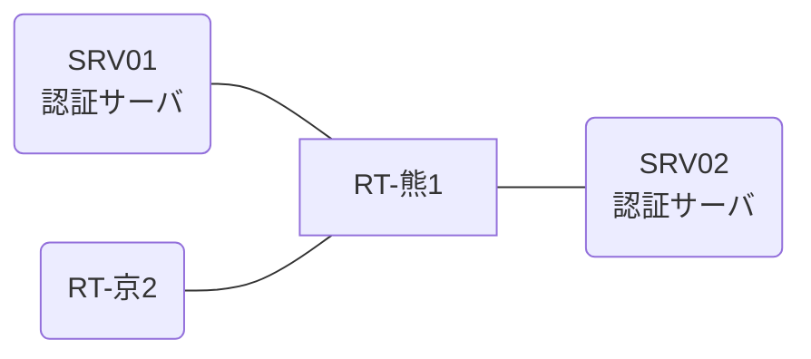

# 問題 20261229-029

> **本問は機器に接続せずに解答すること。追加の show 実行は認めない。**

## トポロジ

あなたは、ネットワークの運用を担当しています。2 つの拠点のルータが、共通の認証サーバ群を用いて、管理者の認証を行うように構成されています。一方のルータはサーバと直結しており、他方はそのルーターを経由してサーバに到達します。



### 認証サーバの仕様

| 項目 | SRV01 | SRV02 |
|---|---|---|
| アドレス | 10.99.94.2 | 10.99.95.2 |
| 待受ポート | 1812 / 1813 | 11812 / 11813 |
| 共有鍵 | Rad-8102 | Rad-8102 |
| 受理する送信元 | 10.1.0.1 ・ 10.2.0.2 | 同左 |
| 台帳 | noc-taro(15) ・ desk-01(1) ・ SUZUKI(15) | 同左 |
| 現在の稼働状態 | 稼働中 | 稼働中 |

### ルータのアドレス

| ルータ | Loopback0 | 認証サーバ方向のインタフェース |
|---|---|---|
| RT-熊1(熊本) | 10.1.0.1 | Ethernet0/0 = 10.99.94.1 |
| RT-京2(京都) | 10.2.0.2 | Ethernet0/0 = 10.56.12.2 |

## 要件

1. 熊本・京都 の両拠点で、利用者 noc-taro が権限レベル 15 で機器を操作できること。
2. 既定の方式リストは変更しないこと。
3. 認証は認証サーバ群 RAD-GROUP を用いること。

## 現在の状態

特権レベルへの昇格が試行された際の、デバッグの出力が、採取されました。

```
RT-京2# debug aaa authentication
AAA/AUTHEN/START (1560798390): port='con 0' list='' action=LOGIN service=ENABLE
AAA/AUTHEN/START (1560798390): console enable - default to enable password (if any)
AAA/AUTHEN/START (1560798390): Method=ENABLE
AAA/AUTHEN (1560798390): status = GETPASS
AAA/AUTHEN/CONT (1560798390): continue_login (user='(undef)')
AAA/AUTHEN (1560798390): status = GETPASS
AAA/AUTHEN/CONT (1560798390): Method=ENABLE
AAA/AUTHEN(1560798390): password incorrect
AAA/AUTHEN (1560798390): status = FAIL
```

## 設定抜粋

```
RT-京2# show running-config | section aaa
aaa new-model
!
aaa group server radius RAD-GROUP
 server name RAD1
 server name RAD2
 deadtime 5
!
enable secret 5 $1$aaaa
radius-server timeout 5
radius-server retransmit 1
```

## 設問

示されているところの出力について、正しい記述は、どれですか。(2つを選択してください)

## 選択肢
A. method1 として enable パスワードによる認証が行われている。

B. 特権レベルへの昇格の認証について、方式リストが構成されていない。

C. method2 は試行されていない。

D. この操作は、コンソール以外の回線から行われている。
