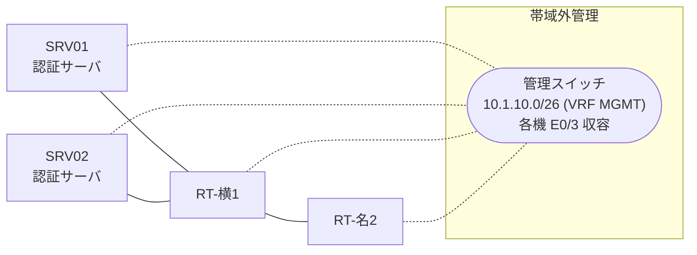

# 問題 20261229-033

> **本問は機器に接続せずに解答すること。追加の show 実行は認めない。**

## シナリオ

あなたは、下記のネットワークの保守を担当する技術者です。2 つの拠点のルータが、共通の認証サーバ群を用いて、管理者の認証を行うように構成されています。一方のルータはサーバと直結しており、他方はそのルーターを経由してサーバに到達します。ユーザーから、通信に関する事象が、報告されています。示されているところの出力および構成に基づいて、要求されているところの動作が得られていない理由が、判断されなければなりません。横浜・名古屋 の両拠点で、利用者 netadmin が権限レベル 15 で機器を操作できること。運用者の遠隔からの接続が失われないこと。認証は認証サーバ群 RADGRP を用いること。緊急時にコンソールから操作できる経路を失わないこと。



### 認証サーバの仕様

| 項目 | SRV01 | SRV02 |
|---|---|---|
| アドレス | 10.99.149.2 | 10.99.150.2 |
| 待受ポート | 1812 / 1813 | 1645 / 1646 |
| 共有鍵 | Ccnp-Aaa-77 | Ccnp-Aaa-77 |
| 受理する送信元 | 10.6.0.1 ・ 10.2.0.2 | 同左 |
| 台帳 | netadmin(15) ・ watch-op(1) ・ SUZUKI(15) | 同左 |
| 現在の稼働状態 | 稼働中 | 稼働中 |

### ルータのアドレス

| ルータ | Loopback0 | 認証サーバ方向のインタフェース |
|---|---|---|
| RT-横1(横浜) | 10.6.0.1 | Ethernet0/0 = 10.99.149.1 |
| RT-名2(名古屋) | 10.2.0.2 | Ethernet0/0 = 10.53.12.2 |

## 出力

```
横浜: No authoritative response from any server. (約 18 秒)
名古屋: User was successfully authenticated. (即時)
```
```
RT-横1# show running-config | section aaa
aaa new-model
!
radius server RAD1
 address ipv4 10.99.149.2 auth-port 1812 acct-port 1813
 key Ccnp-Aaa-77
!
radius server RAD2
 address ipv4 10.99.150.2 auth-port 1645 acct-port 1646
 key Ccnp-Aaa-77
!
aaa group server radius RADGRP
 server name RAD1
 server name RAD2
 deadtime 5
!
aaa authentication login default group RADGRP local
aaa authentication login CONSOLE local
aaa authorization exec default group RADGRP local
aaa authorization exec CONSOLE local
aaa authorization console
!
ip radius source-interface Loopback0
radius-server timeout 3
radius-server retransmit 2
!
username emg-admin privilege 15 secret 5 $1$xxxx
username SUZUKI privilege 15 secret 5 $1$yyyy
!
ip access-list extended UPLINK-ACL
 deny   udp any eq 1645 any
 deny   udp any eq 1812 any
 permit ip any any
!
interface Ethernet0/0
 ip access-group UPLINK-ACL in
!
line con 0
 exec-timeout 0 0
 logging synchronous
 login authentication CONSOLE
 authorization exec CONSOLE
line vty 0 4
 exec-timeout 0 0
 transport input ssh
line vty 5 15
 exec-timeout 0 0
 transport input ssh
```
```
RT-名2# show running-config | section aaa
aaa new-model
!
radius server RAD1
 address ipv4 10.99.149.2 auth-port 1812 acct-port 1813
 key Ccnp-Aaa-77
!
radius server RAD2
 address ipv4 10.99.150.2 auth-port 1645 acct-port 1646
 key Ccnp-Aaa-77
!
aaa group server radius RADGRP
 server name RAD1
 server name RAD2
 deadtime 5
!
aaa authentication login default group RADGRP local
aaa authentication login CONSOLE local
aaa authorization exec default group RADGRP local
aaa authorization exec CONSOLE local
aaa authorization console
!
ip radius source-interface Loopback0
radius-server timeout 3
radius-server retransmit 2
!
username emg-admin privilege 15 secret 5 $1$xxxx
username SUZUKI privilege 15 secret 5 $1$yyyy
!
line con 0
 exec-timeout 0 0
 logging synchronous
 login authentication CONSOLE
 authorization exec CONSOLE
line vty 0 4
 exec-timeout 0 0
 transport input ssh
line vty 5 15
 exec-timeout 0 0
 transport input ssh
```

## 設問

次のうち、正しいものは、どれですか。

## 選択肢
**A.**
```
| 拠点 | ユーザ | 結果 |
|---|---|---|
| 横浜 | netadmin | ログイン可(権限レベル 15) |
| 横浜 | watch-op | ログイン可(権限レベル 1) |
| 横浜 | emg-admin | ログイン不可 |
| 横浜 | watch-op からの特権昇格 | 昇格可(15) |
| 横浜 | netadmin(6 セッション目以降) | ログイン可(権限レベル 15) |
| 横浜 | emg-admin(コンソールから) | ログイン可(権限レベル 1) |
| 名古屋 | netadmin | ログイン可(権限レベル 15) |
| 名古屋 | watch-op | ログイン可(権限レベル 1) |
| 名古屋 | emg-admin | ログイン不可 |
| 名古屋 | watch-op からの特権昇格 | 昇格可(15) |
| 名古屋 | netadmin(6 セッション目以降) | ログイン可(権限レベル 15) |
| 名古屋 | emg-admin(コンソールから) | ログイン可(権限レベル 15) |

認証サーバがすべて停止した場合:

| 拠点 | ユーザ | 結果 |
|---|---|---|
| 横浜 | emg-admin | ログイン可(権限レベル 15) |
| 横浜 | SUZUKI | ログイン可(権限レベル 15) |
| 横浜 | emg-admin(コンソールから) | ログイン可(権限レベル 1) |
| 名古屋 | emg-admin | ログイン可(権限レベル 15) |
| 名古屋 | SUZUKI | ログイン可(権限レベル 15) |
| 名古屋 | emg-admin(コンソールから) | ログイン可(権限レベル 15) |
```
**B.**
```
| 拠点 | ユーザ | 結果 |
|---|---|---|
| 横浜 | netadmin | ログイン不可 |
| 横浜 | watch-op | ログイン不可 |
| 横浜 | emg-admin | ログインは通るが exec 拒否 |
| 横浜 | netadmin(6 セッション目以降) | ログイン不可 |
| 横浜 | emg-admin(コンソールから) | ログイン可(権限レベル 15) |
| 名古屋 | netadmin | ログイン可(権限レベル 15) |
| 名古屋 | watch-op | ログイン可(権限レベル 1) |
| 名古屋 | emg-admin | ログイン不可 |
| 名古屋 | watch-op からの特権昇格 | 昇格可(15) |
| 名古屋 | netadmin(6 セッション目以降) | ログイン可(権限レベル 15) |
| 名古屋 | emg-admin(コンソールから) | ログイン可(権限レベル 15) |

認証サーバがすべて停止した場合:

| 拠点 | ユーザ | 結果 |
|---|---|---|
| 横浜 | emg-admin | ログイン可(権限レベル 15) |
| 横浜 | SUZUKI | ログイン可(権限レベル 15) |
| 横浜 | emg-admin(コンソールから) | ログイン可(権限レベル 15) |
| 名古屋 | emg-admin | ログイン可(権限レベル 15) |
| 名古屋 | SUZUKI | ログイン可(権限レベル 15) |
| 名古屋 | emg-admin(コンソールから) | ログイン可(権限レベル 15) |
```
**C.**
```
| 拠点 | ユーザ | 結果 |
|---|---|---|
| 横浜 | netadmin | ログイン不可 |
| 横浜 | watch-op | ログイン不可 |
| 横浜 | emg-admin | ログイン可(権限レベル 15) |
| 横浜 | netadmin(6 セッション目以降) | ログイン不可 |
| 横浜 | emg-admin(コンソールから) | ログイン可(権限レベル 15) |
| 名古屋 | netadmin | ログイン可(権限レベル 15) |
| 名古屋 | watch-op | ログイン可(権限レベル 1) |
| 名古屋 | emg-admin | ログイン不可 |
| 名古屋 | watch-op からの特権昇格 | 昇格可(15) |
| 名古屋 | netadmin(6 セッション目以降) | ログイン可(権限レベル 15) |
| 名古屋 | emg-admin(コンソールから) | ログイン可(権限レベル 15) |

認証サーバがすべて停止した場合:

| 拠点 | ユーザ | 結果 |
|---|---|---|
| 横浜 | emg-admin | ログイン可(権限レベル 15) |
| 横浜 | SUZUKI | ログイン可(権限レベル 15) |
| 横浜 | emg-admin(コンソールから) | ログイン可(権限レベル 15) |
| 名古屋 | emg-admin | ログイン可(権限レベル 15) |
| 名古屋 | SUZUKI | ログイン可(権限レベル 15) |
| 名古屋 | emg-admin(コンソールから) | ログイン可(権限レベル 15) |
```
**D.**
```
| 拠点 | ユーザ | 結果 |
|---|---|---|
| 横浜 | netadmin | ログイン可(権限レベル 15) |
| 横浜 | watch-op | ログイン可(権限レベル 1) |
| 横浜 | emg-admin | ログイン不可 |
| 横浜 | watch-op からの特権昇格 | 昇格不可 |
| 横浜 | netadmin(6 セッション目以降) | ログイン可(権限レベル 15) |
| 横浜 | emg-admin(コンソールから) | ログイン可(権限レベル 15) |
| 名古屋 | netadmin | ログイン可(権限レベル 15) |
| 名古屋 | watch-op | ログイン可(権限レベル 1) |
| 名古屋 | emg-admin | ログイン不可 |
| 名古屋 | watch-op からの特権昇格 | 昇格可(15) |
| 名古屋 | netadmin(6 セッション目以降) | ログイン可(権限レベル 15) |
| 名古屋 | emg-admin(コンソールから) | ログイン可(権限レベル 15) |

認証サーバがすべて停止した場合:

| 拠点 | ユーザ | 結果 |
|---|---|---|
| 横浜 | emg-admin | ログイン可(権限レベル 15) |
| 横浜 | SUZUKI | ログイン可(権限レベル 15) |
| 横浜 | emg-admin(コンソールから) | ログイン可(権限レベル 15) |
| 名古屋 | emg-admin | ログイン可(権限レベル 15) |
| 名古屋 | SUZUKI | ログイン可(権限レベル 15) |
| 名古屋 | emg-admin(コンソールから) | ログイン可(権限レベル 15) |
```
