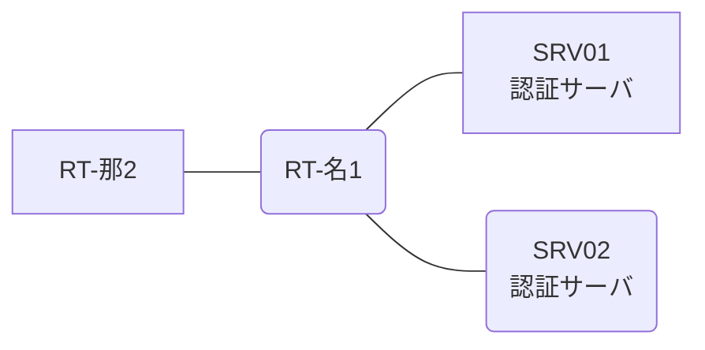

# 問題 20261229-040

> **本問は機器に接続せずに解答すること。追加の show 実行は認めない。**

## トポロジ

あなたは、ネットワークの運用を担当しています。2 つの拠点のルータが、共通の認証サーバ群を用いて、管理者の認証を行うように構成されています。一方のルータはサーバと直結しており、他方はそのルーターを経由してサーバに到達します。



### 認証サーバの仕様

| 項目 | SRV01 | SRV02 |
|---|---|---|
| アドレス | 10.99.94.2 | 10.99.95.2 |
| 待受ポート | 1812 / 1813 | 1912 / 1913 |
| 共有鍵 | Ccnp-Aaa-77 | Ccnp-Aaa-77 |
| 受理する送信元 | 10.7.0.1 ・ 10.6.0.2 | 同左 |
| 台帳 | noc-taro(15) ・ monitor-op(1) ・ SUZUKI(15) | 同左 |
| 現在の稼働状態 | 稼働中 | 稼働中 |

### ルータのアドレス

| ルータ | Loopback0 | 認証サーバ方向のインタフェース |
|---|---|---|
| RT-名1(名古屋) | 10.7.0.1 | Ethernet0/0 = 10.99.94.1 |
| RT-那2(那覇) | 10.6.0.2 | Ethernet0/0 = 10.94.12.2 |

## 要件

1. 名古屋・那覇 の両拠点で、利用者 noc-taro が権限レベル 15 で機器を操作できること。
2. 移行の作業中に、運用者の遠隔からの接続が失われないこと。
3. 認証は認証サーバ群 NOC-RADIUS を用いること。
4. 移行の前後にわたり、緊急時にコンソールから操作できる経路を失わないこと。

## 現在の状態

ローカルの認証から、認証サーバ群を用いる認証への移行が、実施されようとしています。作業は、遠隔からの接続によって行われています。


## 設定抜粋

```
RT-名1# show running-config | section aaa
aaa new-model
!
radius server RAD1
 address ipv4 10.99.94.2 auth-port 1812 acct-port 1813
 key Ccnp-Aaa-77
!
radius server RAD2
 address ipv4 10.99.95.2 auth-port 1912 acct-port 1913
 key Ccnp-Aaa-77
!
aaa group server radius NOC-RADIUS
 server name RAD1
 server name RAD2
 deadtime 5
!
aaa authentication login default local
aaa authentication login CONSOLE local
aaa authorization exec default local
aaa authorization exec CONSOLE local
!
ip radius source-interface Loopback0
!
username noc-taro privilege 15 secret 5 $1$zzzz
username emg-admin privilege 15 secret 5 $1$xxxx
username SUZUKI privilege 15 secret 5 $1$yyyy
!
line con 0
 exec-timeout 0 0
 logging synchronous
 login authentication CONSOLE
 authorization exec CONSOLE
line vty 0 4
 exec-timeout 0 0
 transport input ssh
line vty 5 15
 exec-timeout 0 0
 transport input ssh
```
```
RT-那2# show running-config | section aaa
aaa new-model
!
radius server RAD1
 address ipv4 10.99.94.2 auth-port 1812 acct-port 1813
 key Ccnp-Aaa-77
!
radius server RAD2
 address ipv4 10.99.95.2 auth-port 1912 acct-port 1913
 key Ccnp-Aaa-77
!
aaa group server radius NOC-RADIUS
 server name RAD1
 server name RAD2
 deadtime 5
!
aaa authentication login default local
aaa authentication login CONSOLE local
aaa authorization exec default local
aaa authorization exec CONSOLE local
!
ip radius source-interface Loopback0
!
username noc-taro privilege 15 secret 5 $1$zzzz
username emg-admin privilege 15 secret 5 $1$xxxx
username SUZUKI privilege 15 secret 5 $1$yyyy
!
line con 0
 exec-timeout 0 0
 logging synchronous
 login authentication CONSOLE
 authorization exec CONSOLE
line vty 0 4
 exec-timeout 0 0
 transport input ssh
line vty 5 15
 exec-timeout 0 0
 transport input ssh
```

## 設問

現在の接続が失われることなく、移行を進めるために、次に適用されなければならない構成は、どれですか。(1つを選択してください)

## 選択肢
A. no ip radius source-interface Loopback0

B. 認証サーバの利用者台帳に、運用者を登録する。

**C.**
```
aaa authentication login default group NOC-RADIUS local
aaa authorization exec default group NOC-RADIUS local
```

**D.**
```
aaa authentication login CONSOLE local
aaa authorization exec CONSOLE local
line con 0
 login authentication CONSOLE
 authorization exec CONSOLE
 exit
```
